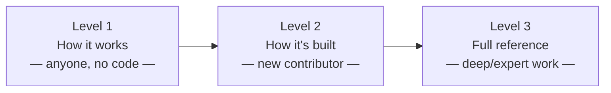

# OpenLPM docs

## Architecture: visual models of how OpenLPM is actually built

Three documents, same system, three levels of depth — written and diagrammed directly from the real code and database schema (not from memory or design intent), verified 2026-10-02:



- **[1 — How OpenLPM works](architecture/1-how-it-works.md)** — a plain-language tour for anyone: a research group deciding whether to use it, a new team member, a curious reader. No programming or database background assumed.
- **[2 — How it's built](architecture/2-how-its-built.md)** — the real screens, system components, and a simplified data model, for a new contributor or technically-curious partner orienting to this codebase for the first time.
- **[3 — Full reference](architecture/3-full-reference.md)** — the complete schema, the permission system, known gotchas (including two real bugs already caught in this exact codebase), and the project lifecycle — for anyone doing serious work on the system itself.

This is a working draft, written for internal use (the team, pilot partners who ask for it, future Claude Code sessions) rather than polished for a general public audience — it says so plainly where something is still in flux rather than smoothing that over.

### Keeping it honest

These docs make specific, checkable claims (table counts, route counts, function names). `scripts/check_docs_freshness.mjs` re-derives those same facts from the real migration files and `src/App.tsx` and flags anything that's drifted since the docs were last reviewed:

```
node scripts/check_docs_freshness.mjs
```

See [Level 3's closing section](architecture/3-full-reference.md#keeping-this-current) for how it works and when to re-run it with `--update`.

## Other documents in this folder

- **[openevo-ccs-learning-loop.md](openevo-ccs-learning-loop.md)** — how OpenLPM and the broader OpenEvo CCS Lab ecosystem learn from each other. Not about OpenLPM's own architecture — see above for that.
