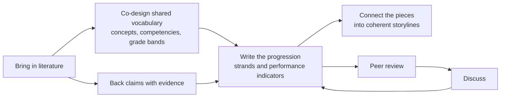
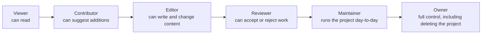
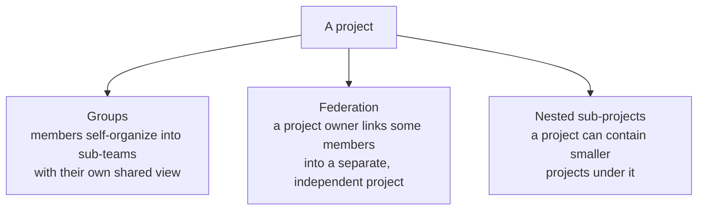
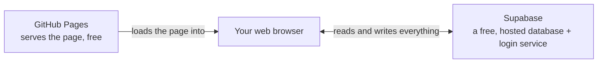

[ Level 1 of 3 — plain-language tour ] · [Level 2: how it's built →](2-how-its-built.md) · [Level 3: full reference →](3-full-reference.md)

# How OpenLPM works

**Who this is for:** anyone who wants an accurate picture of how OpenLPM works without reading any code — a research group deciding whether to use it, a new team member, a pilot partner, a curious reader. Nothing below assumes programming or database experience.

## What OpenLPM actually is

OpenLPM is a shared workspace for a research group building a Learning Progression Model (a structured map of how understanding of a topic should develop across grade levels) together — instead of doing that work across scattered spreadsheets, documents, and email threads. It's free to run and doesn't need a dedicated engineer to keep it online.

## The shape of one project

Everything in OpenLPM happens inside a **project** — one research group's workspace. Inside it, the work roughly flows like this (in practice people jump around and work on several of these at once, rather than marching through in strict order):

- **Literature** — search and verify sources (OpenLPM checks DOIs automatically), so the evidence base is trustworthy from the start.
- **Shared vocabulary** — the group agrees on the concepts and competencies the progression is built from, with discussion attached to each one.
- **The progression itself** — strands, sub-strands, performance indicators, and assessment items: the actual content, stored as structured data rather than prose in a document.
- **Storylines** — a named, sequenced thread showing how one idea plays out across the whole progression (e.g., how "variation" shows up from early grades through advanced ones).
- **Evidence** — every piece of the progression can be traced back to the literature that supports it.
- **Review and discussion** — a transparent, structured path from draft to accepted, with threaded conversation attached to the specific thing being discussed.

## Who can do what

Every person in a project has one role, roughly ordered from least to most access:

A project's owner or maintainer decides who gets which role — most new members start as **Contributor** by default.

## Two ways a project can grow

As of October 2026, a project can expand in two different directions:

- **Groups** are sub-teams *within* one project — useful once a project has more members than fit comfortably in one shared view.
- **Federation** is a lateral link *between two separate projects* — a project owner can share some of their members' access into another project, without merging the two projects together.
- **Nesting** lets a project contain smaller sub-projects underneath it (for example, a draft piece of work that later becomes its own fully independent project).

## Where your data actually lives

OpenLPM's own code is just a web page — it runs entirely in your browser. All the real content (literature, concepts, strands, discussions) lives in [Supabase](https://supabase.com), a free, hosted database-and-login service that OpenLPM talks to directly. There's no separate server to install, configure, or keep running — which is the whole point: a research group can stand this up without dedicated engineering support.

## Want more detail?

[Level 2: how it's built →](2-how-its-built.md) walks through the real screens, the real system components, and a simplified version of the actual data model — for anyone comfortable with general web/database concepts who wants to go deeper.
