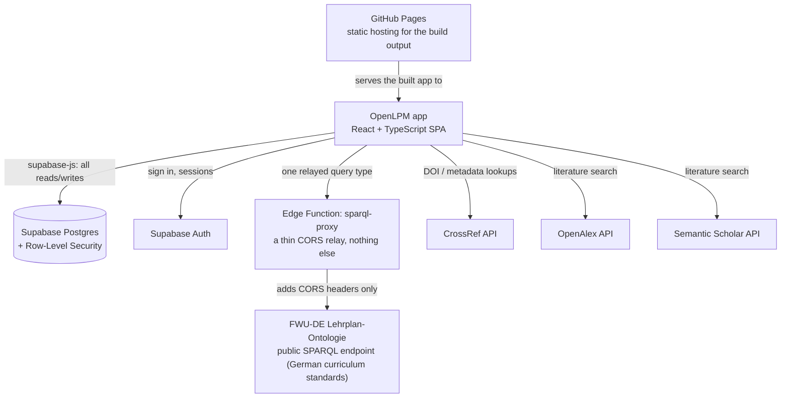
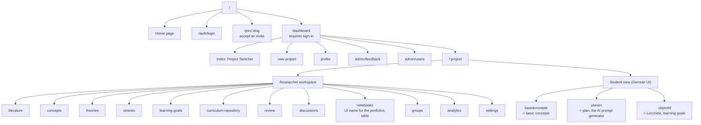

[Level 1: plain-language tour ←](1-how-it-works.md) · [ Level 2 of 3 — how it's built ] · [Level 3: full reference →](3-full-reference.md)

# How OpenLPM is built

**Who this is for:** someone comfortable with general web-app and database concepts who is new to *this* codebase — a new contributor, or a technically-curious partner. Assumes you know roughly what "React," "a route," and "a database table" mean, but nothing about OpenLPM specifically.

**Verified against the real code** on 2026-10-02: 82 migration files (numbered 001–084), 40 routes across ~24 distinct screens, one backend edge function.

## The tech stack, in one line

A static **React + TypeScript** single-page app (built with Vite), talking directly to **Supabase** (hosted Postgres + Auth + one small Edge Function), deployed as static files to **GitHub Pages**. No application server to run or deploy.

## System components



The edge function is deliberately minimal: it exists only because the public FWU-DE endpoint doesn't send a browser-friendly CORS header. All the real query-building logic lives in the frontend (`src/lib/importers/fwuLehrplan.ts`), not in the function — so that logic can change without redeploying anything backend-side.

## The screen map

OpenLPM has two parallel faces on the same project data: a full **researcher workspace**, and a simplified, German-language **student view** nested under the same project route. Both are real, live routes in `src/App.tsx`:



Two naming things worth knowing before you go looking for code:

- **"Notebooks" in the UI is the `portfolios` table in the database.** The rename happened in the interface, not in the schema.
- **The student view's routes are named in German** (`basiskonzepte`, `planen`) because it was built for a German-language pilot. It's a simplified lens over mostly the same underlying data as the researcher workspace's `concepts` and `learning-goals` pages, not a separate data model.

## A simplified map of the core data

This is the real spine of OpenLPM's data model — the tables most of the researcher workspace is built on — simplified to the columns that matter for understanding the shape. The full schema (all 54 tables) is in [Level 3](3-full-reference.md).

```mermaid
erDiagram
    projects ||--o{ project_members : has
    projects ||--o{ branches : has
    projects ||--o{ lpm_schema_elements : defines
    projects ||--o{ lpm_data_objects : contains
    projects ||--o{ literature_references : collects
    branches ||--o{ lpm_schema_elements : "drafts on"
    branches ||--o{ lpm_data_objects : "drafts on"
    lpm_data_objects ||--o{ lpm_connections : from
    lpm_data_objects ||--o{ lpm_connections : to
    lpm_threads ||--o{ lpm_thread_stations : sequences
    lpm_data_objects ||--o{ lpm_thread_stations : "appears in"
    literature_references ||--o{ evidence_links : backs

    projects {
        uuid id PK
        text name
        enum status
        enum maturity
    }
    project_members {
        uuid project_id FK
        uuid user_id FK
        enum role
    }
    branches {
        uuid id PK
        uuid project_id FK
        bool is_trunk
        enum status
    }
    lpm_schema_elements {
        uuid id PK
        uuid project_id FK
        uuid branch_id FK
        enum element_type
        text label
    }
    lpm_data_objects {
        uuid id PK
        uuid project_id FK
        uuid branch_id FK
        enum object_type
        text title
    }
    lpm_connections {
        uuid from_object_id FK
        uuid to_object_id FK
        enum kind
    }
    lpm_threads {
        uuid id PK
        text title
        enum thread_type
    }
    lpm_thread_stations {
        uuid thread_id FK
        uuid data_object_id FK
        int sequence
    }
    literature_references {
        uuid id PK
        text doi
        bool crossref_verified
    }
    evidence_links {
        uuid id PK
        enum target_type
        uuid target_id
        enum evidence_type
    }
```

**Two simplifications to know about.** First: `branches` looks like an active drafting mechanism here, but it's mostly historical — every real project today has exactly one branch (its own trunk), and the actual "draft vs. finished" mechanism in current use is a plain status field on `projects` itself, not branching. [Level 3](3-full-reference.md#4-how-a-project-matures) has the real story and why it changed.

Second: `evidence_links` is drawn here pointing only at `literature_references`, but it actually works the other way — each `evidence_links` row points at *any one* of several kinds of target (a schema element, a data object, a connection, or a thread) through a generic `target_type` / `target_id` pair, not a dedicated foreign key per kind. This same pattern — a generic pointer instead of one column per possible target — repeats across five different tables in OpenLPM. It's common enough, and has a real tradeoff worth knowing, that it gets its own section in [Level 3](3-full-reference.md#the-polymorphic-link-pattern).

## Want the full picture?

[Level 3: full reference →](3-full-reference.md) has the complete schema (all 54 tables), the permission-check system, two real bugs already caught in this exact codebase, and how a project actually moves from draft to established to federated.
