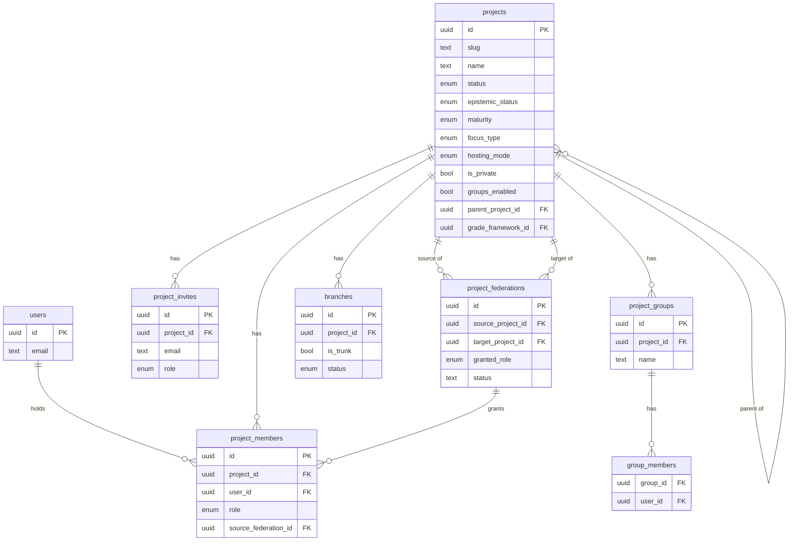
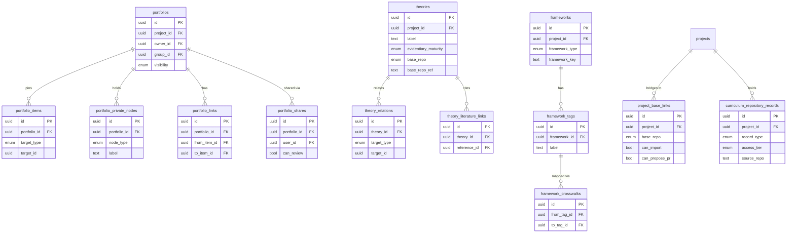
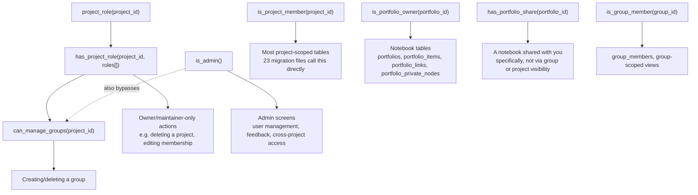
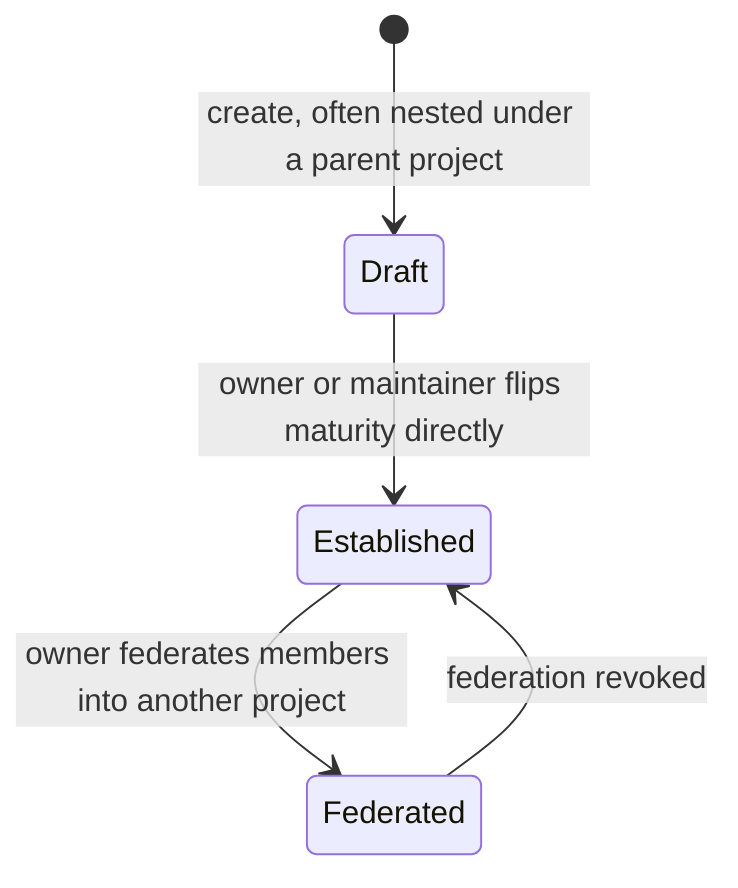

[Level 1: plain-language tour ←](1-how-it-works.md) · [Level 2: how it's built ←](2-how-its-built.md) · [ Level 3 of 3 — full reference ]

# OpenLPM: full architecture reference

**Who this is for:** someone doing real work on the system itself — adding a table, auditing permissions, onboarding as a serious contributor, or (most often) a future Claude Code session picking this repo back up.

**Verified directly against the code** on 2026-10-02: 82 migration files (numbered 001–084, two numbers unused), 54 tables, all but a handful with Row-Level Security enabled (193 policies total), 7 permission-check functions, 40 routes across ~24 distinct screens, 1 Supabase Edge Function. Run `node scripts/check_docs_freshness.mjs` any time to check whether those numbers still match reality — see [Keeping this current](#keeping-this-current) at the bottom.

**A note on sources:** `src/lib/supabase/database.types.ts` (the auto-generated TypeScript types) is useful but was confirmed stale as of this writing — it predates the last ~10 migrations (project groups, project federation, several others) and is even missing a real foreign key on a table it does cover (`evidence_links.reference_id`). Everything below is drawn from the actual SQL migration files, which are the real source of truth, not from the generated types. See [Known gotchas](#known-gotchas) for what this means practically.

## 1. Project, access, and federation

This is the layer that decides who can see and touch what.



Things worth knowing that aren't obvious from the picture:

- **`role` (on `project_members`) is one enum, shared everywhere**: `owner`, `maintainer`, `editor`, `reviewer`, `contributor`, `viewer` — in that order. Default is `contributor`. The same enum is reused on `project_invites.role` and as the type of `project_federations.granted_role` and `projects.group_creator_roles` (an array).
- **`branches` is real but largely historical.** Migration 004 built it as a fork/draft mechanism. Migration 016 (2026-09) found, by checking live data directly, that every real project had exactly one branch (its own trunk) and that nested sub-projects (`parent_project_id`, migration 015) did everything branches did, better — so it folded "draft vs. proven" into the plain `maturity` status instead. The table, its columns, and the one surviving historical non-trunk branch record (`evomentor-de`) were deliberately left in place as a safety net, but there is no branches UI left in the frontend (`src/` has no file mentioning branches at all) and no new code should treat branching as the way projects evolve. See [section 4](#4-how-a-project-matures) for the mechanism actually in use today.
- **Federation (migration 084, 2026-10-02) is the newest growth mechanism**, and it's deliberately boring at the data level: federating a member into another project just creates a real `project_members` row (tagged with `source_federation_id` so it can be cleanly revoked later). Every existing permission check in the whole codebase keeps working on a federated member with zero changes, because as far as any of those checks can tell, a federated member is a normal member. `granted_role` can never be `owner` (enforced by a `CHECK` constraint).
- **A project can be private** (`is_private`) independently of whether it's self-hosted or using the shared hosted instance (`hosting_mode`) — these are two unrelated axes, not the same setting.
- **Self-serve joining** (the `/join/:slug` route) is driven by a separate table, `project_join_rules`: a project can pre-approve anyone arriving with a specific email, or any email on a given domain (e.g. `uni-jena.de`), and auto-grant them a chosen role — distinct from a one-off `project_invites` row sent to a single person.

## 2. The learning-progression content spine

This is the actual intellectual content of a project — the part researchers spend most of their time in.

```mermaid
erDiagram
    lpm_schema_elements ||--o{ lpm_schema_elements : "parent of"
    lpm_schema_elements ||--o{ lpm_threads : explains
    lpm_data_objects ||--o{ lpm_connections : from
    lpm_data_objects ||--o{ lpm_connections : to
    lpm_threads ||--o{ lpm_thread_stations : sequences
    lpm_data_objects ||--o{ lpm_thread_stations : "is a station"
    lpm_data_objects ||--o{ strand_parents : "as strand"
    lpm_data_objects ||--o{ strand_parents : "as parent"
    literature_references ||--o{ evidence_links : backs
    discussion_topics ||--o{ discussion_posts : has
    discussion_posts ||--o{ discussion_posts : "replies to"

    lpm_schema_elements {
        uuid id PK
        uuid project_id FK
        uuid branch_id FK
        enum element_type
        text label
        uuid parent_id FK
        enum status
    }
    lpm_data_objects {
        uuid id PK
        uuid project_id FK
        uuid branch_id FK
        enum object_type
        text title
        enum status
    }
    lpm_connections {
        uuid id PK
        uuid project_id FK
        uuid from_object_id FK
        uuid to_object_id FK
        text relation_type
        enum kind
        enum status
    }
    lpm_threads {
        uuid id PK
        uuid project_id FK
        enum thread_type
        text title
        uuid explained_by_element_id FK
    }
    lpm_thread_stations {
        uuid id PK
        uuid thread_id FK
        uuid data_object_id FK
        int sequence
    }
    strand_parents {
        uuid strand_id FK
        uuid parent_strand_id FK
    }
    literature_references {
        uuid id PK
        uuid project_id FK
        text doi
        bool crossref_verified
        enum status
    }
    evidence_links {
        uuid id PK
        enum target_type
        uuid target_id
        uuid reference_id FK
        enum evidence_type
    }
    discussion_topics {
        uuid id PK
        uuid project_id FK
        text title
        enum linked_type
        uuid linked_id
    }
    discussion_posts {
        uuid id PK
        uuid topic_id FK
        uuid parent_id FK
        enum post_type
    }
```

Two distinct relationship concepts live side by side here, and it's easy to conflate them:

- **`lpm_connections`** is a plain pairwise edge between two data objects — "A relates to B," `asserted` or merely `suggested`, with a free-text `relation_type`.
- **`lpm_threads` + `lpm_thread_stations`** is a *named, ordered, narrative sequence* through several data objects — a "storyline" (`thread_type`: `vertical`, `horizontal`, or both) with its own title, connecting idea, and narrative text, optionally anchored to a specific concept via `explained_by_element_id`. This is the mechanism behind what Level 1 calls a coherent storyline, and it's a more deliberate authoring act than a connection.
- **`strand_parents`** is separate again: it lets one strand (a `lpm_data_objects` row) declare more than one parent strand — a real many-to-parent structure, distinct from `lpm_schema_elements.parent_id`, which is a plain single-parent tree for concepts/competencies.
- **`discussion_posts.post_type`** is richer than plain comments: `comment`, `revision`, `elaboration`, or `annotation` — the discussion system distinguishes a correction from a comment from an add-on, not just free text.

`evidence_links`, `peer_review_assignments` (not pictured above — see [the polymorphic link pattern](#the-polymorphic-link-pattern)), and `discussion_topics.linked_id` all also point at *other* kinds of objects beyond what's drawn here (schema elements, connections, threads). That's deliberate, and important enough to get its own section below rather than being implied by extra diagram arrows.

## 3. Portfolios, theories, and external alignment

The remaining project-scoped content: personal/shared workspaces, theoretical grounding, and links out to standards and the wider OpenEvo ecosystem.



Notes:

- **`portfolios.visibility`** is `private`, `shared` (via `portfolio_shares`), `project` (any member), or — since migration 076, 2026-10-02 — `group` (any member of the specific `project_groups` row named by `group_id`, or anyone with group-management rights on the project).
- **A "Notebook" (the UI name) is a `portfolios` row.** `portfolio_items` pins an existing schema element or data object into it; `portfolio_private_nodes` holds things that only exist inside the notebook itself (a note, a question, a draft concept or lesson that hasn't become real project content yet); `portfolio_links` draws connections between any two of those — and each end of a link can be *either* a pinned item *or* a private node (`from_item_id`/`from_private_id`, `to_item_id`/`to_private_id` — only one of each pair is set), a different flexible-pointer shape than the `target_type`/`target_id` pattern used elsewhere.
- **`theories.base_repo` / `base_repo_ref`** and **`project_base_links`** are two independent bridges to the main OpenEvo ecosystem's Foundational Repos (ConceptBase, TheoryBase, and eight others) — one lets a single theory point at where it really comes from; the other is a project-level setting for which repos a project is allowed to import from or propose changes back into. Neither is built out as a two-way sync; both are currently one-directional pointers/permission flags.
- **`curriculum_repository_records`** is broader than "imported standards documents." Its `record_type` enum (`institutional-actor-record`, `policy-timeline-event`, `coherence-finding-record`, `synthetic-curriculum-redesign-record`, `policy-brief-manifest`, and others) is the same shape used for regional curriculum-*policy* projects (the kind of work nys_lp/deutsche_lp/india_lp do), not just grade-band standards alignment — OpenLPM's schema doesn't actually distinguish "an LPM project" from "a regional policy project." `access_tier` (`full-text-stored` / `excerpt-only` / `summary-only` / `citation-only`) controls how much of a source a record is allowed to carry, for licensing reasons.
- **`frameworks.project_id` is nullable.** A framework can be global and shared across every project (a seeded reference framework) or scoped to one project.

## The polymorphic link pattern

Five different tables need to point at "some other piece of project content," but that content can be several different kinds of thing. Rather than one join table per combination, OpenLPM uses the same idiom five times: a `*_type` enum column naming the kind of target, plus a plain `uuid` column holding that target's id — with **no database-level foreign key** on the id column, because Postgres can't enforce a foreign key that points at a different table depending on another column's value.

| Table | Type column | Id column | Can point at |
|---|---|---|---|
| `evidence_links` | `target_type` | `target_id` | schema element, data object, connection, thread |
| `peer_review_assignments` | `reviewable_type` | `reviewable_id` | literature reference, data object, connection, thread, framework tag, theory, portfolio item, portfolio private node |
| `discussion_topics` | `linked_type` | `linked_id` (nullable) | schema element, data object, literature reference, or nothing (a free-standing topic) |
| `portfolio_items` | `target_type` | `target_id` | schema element, data object |
| `theory_relations` | `target_type` | `target_id` | framework tag, schema element, data object, thread |

**The real tradeoff**: this is why none of these five tables show up with a foreign-key arrow to their targets in the diagrams above, and it's not just a documentation simplification — the database genuinely cannot stop you from inserting a `target_id` that doesn't exist, or from leaving one dangling after its target is hard-deleted. In practice this is manageable because almost everything in the content spine is soft-managed through a `status` field (`draft`/`proposed`/`accepted`/`rejected`/`deprecated`, depending on the table) rather than ever being hard-deleted — but it's a real gap, not a theoretical one, and worth checking directly (not assuming) before adding a hard-delete path for any of the eleven object kinds named in the table above.

## Permissions and Row-Level Security

Every RLS-enabled table is gated by one of seven `SECURITY DEFINER` functions (defined this way specifically so they can read `project_members`/`portfolio_shares` regardless of the calling row's own RLS, which is what makes them safe to call *from inside* another table's policy without recursing):



Two real gotchas to know before touching any of this:

**A bug class this ecosystem has hit twice already**: a permission function gets defined and correctly used by *one* relevant policy, but a sibling policy on related data forgets to call it — not a missing function, a missing *reference* to it, caught both times only by hand-testing an edge case rather than by reading the policy text. `has_portfolio_share()` itself exists because of a related, sharper version of this: migration 009 found `portfolios`' own policy reading `portfolio_shares`, whose policy read `portfolios` right back — a live infinite-recursion error — and replaced the raw subquery with this function specifically to break the cycle. Migration 076 (2026-10-02) extended that same policy and explicitly left a comment warning not to reintroduce the raw subquery, because it would bring the recursion back. Before adding a new table or policy, grep the whole policy set for the permission function you expect to apply (`grep -rn "function_name" supabase/migrations/`) and check that every policy on related data actually calls it where it logically should.

**A real Postgres trap, already caught once in this exact codebase** (migration 075, on the live database push): `x = ANY((SELECT array_column FROM table WHERE ...))` does *not* mean "is x in that array." Postgres parses it as "x equals any row the subquery returns," which fails outright if that column holds an array type:

```sql
-- Looks like array-membership, but isn't -- fails with
-- "operator does not exist: project_member_role = project_member_role[]":
SELECT role = ANY((SELECT group_creator_roles FROM projects WHERE id = p_project_id));

-- The fix actually shipped (can_manage_groups, migration 075): reference the
-- array column directly inside an EXISTS, not through a bare scalar subquery:
SELECT EXISTS (
  SELECT 1 FROM projects p
  WHERE p.id = p_project_id AND project_role(p_project_id) = ANY(p.group_creator_roles)
);
```

Re-check any new policy or function whose `= ANY(` right-hand side is a parenthesized `SELECT` rather than a plain array parameter or a direct column reference.

## 4. How a project matures

The mechanism actually in use today (since migration 016, superseding the old branch/fork/promote idea described in section 1):



No copy, no fork, no separate "promote" action with its own failure modes — maturing a project is one status flip on a row that already has its own real identity. Federation (section 1) is additive on top of this: a project can federate members at any maturity level; it isn't gated on being `established`.

## Supporting tables

Tables that exist and matter, but don't need their own diagram:

| Table | Purpose |
|---|---|
| `activity_log` | Audit trail of actions taken across a project |
| `feedback` | In-app feedback widget submissions (read via `scripts/read-feedback.mjs`) |
| `tutorials` | Guided in-app tutorial content |
| `project_join_rules` | Self-serve join-by-email/domain rules for the `/join/:slug` flow (see section 1) |
| `prompt_template_libraries`, `prompt_experiments` | Templates and logged runs behind the AI prompt generator (`planen` in the student view) |
| `standards_documents`, `standards_item_changes`, `standards_item_framework_relevance` | Versioned external standards documents and how their items map to OpenLPM frameworks |
| `project_jurisdictions`, `project_subject_area_tags`, `project_repository_links`, `project_source_declarations` | Structured scope/provenance tags on a project, layered on top of the simpler `region_tags`/`theme_tags` arrays on `projects` itself |
| `lpm_object_tags`, `discussion_topic_tags`, `curriculum_repository_record_tags` | Free-form tagging on LPM objects, discussion topics, and repository records respectively |
| `curriculum_repository_links` | Links a `curriculum_repository_records` row to project content |
| `lpm_coherence_reviews` | A structured check that two named "scopes" of the progression are coherent with each other along a chosen axis — a distinct, narrower review type from `peer_review_assignments`' accept/reject pipeline |
| `literature_annotations` | A user's own private notes/questions/insights/critiques on a specific literature reference — personal, not the shared evidence layer |
| `method_basiskonzept_links` | Links a teaching method (a fixed vocabulary key, not its own table) to a Basiskonzept; `is_konzeptanker` marks it as that concept's canonical method |
| `user_favorite_learning_goals`, `user_favorite_methods` | Plain per-user bookmarking of a learning goal or a teaching method |

## Known gotchas

- **The generated TypeScript types lag the real schema.** `src/lib/supabase/database.types.ts` is regenerated by hand, not automatically, and was last touched 2026-10-01 — before the groups, federation, and several other recent migrations. It's also missing at least one real foreign key (`evidence_links.reference_id`) on a table it does cover. Treat the migration files, not the generated types, as ground truth when they disagree. `node scripts/check_docs_freshness.mjs` flags tables the migrations define that the types file doesn't mention yet.
- **This repo's working directory is shared by concurrent sessions.** Branch checkouts and `git stash` affect the one physical folder, not a per-session copy — a plain `git stash` here has swept up a different session's uncommitted work before. Use `git worktree add` for any isolated piece of work, the way this documentation pass did.
- **Migration numbers collide under concurrent work.** Two sessions have independently picked the same next migration number on the same day. `ls supabase/migrations` immediately before writing a new one is necessary but not sufficient — re-check again immediately before `supabase db push`, as close to the push as possible.

## Keeping this current

`scripts/check_docs_freshness.mjs` recomputes the real numbers this document relies on — migration count, table names (from the migrations themselves, not the generated types), permission function names, and route count — and compares them against a small fingerprint file (`docs/architecture/doc-fingerprint.json`) recorded the last time these docs were actually checked against the code.

```
node scripts/check_docs_freshness.mjs
```

prints what's drifted since the fingerprint was last recorded (new tables, new permission functions, a changed route count, or the types-file gap above) without needing any database connection — it only reads local files. It exits non-zero when it finds drift, so it can be dropped into a pre-commit hook or CI later if that's ever wanted; nothing currently calls it automatically.

After actually reviewing and updating these docs against a changed codebase, record the new baseline:

```
node scripts/check_docs_freshness.mjs --update
```
