# openlpm self-model

Generated from `self-model/manifest.json` by `scripts/self_model_check.py --render`. Do not edit by hand; edit the manifest and regenerate.

Checked 2026-10-02: 76 elements (71 implemented, 3 proposed, 2 retired), 0 errors, 0 warnings.

OpenLPM's own model of ITSELF as software (why each part was decided, what it actually enforces, what tables store it) -- not a model of the curricula/theories that researchers build INSIDE OpenLPM (strands, learning goals, theories). Layers run most-abstract (Decided) to most-concrete (Structure); the mappings between them are checked by scripts/self_model_check.py in the lab_manager repo (not copied here, to avoid drift).

## L0 Decided

*What was decided, by whom, and is it still the plan?*

| Element | Status | Realizes | Realized by | Check |
|---|---|---|---|---|
| `decided.platform-foundation` Core platform: literature management, schema co-design, LPM data objects, peer review, evidence linking, discussion forums (the README's own feature list; migration 001) | implemented | - | - | n/a |
| `decided.rfc0001-self-host-default` RFC-0001: every group self-hosts its own instance by default | retired | - | - | n/a |
| `decided.rfc0002-branches` RFC-0002 §3: a two-tier branch/fork/promote mechanism for drafting project content | retired | - | table branches in supabase/migrations | 1 drift |
| `decided.rfc0002-projects-and-portfolios` RFC-0002 §1-2,6: multi-tenant projects, membership roles, personal portfolios referencing canonical content | implemented | - | - | n/a |
| `decided.rfc0002-base-linking` RFC-0002 §5: linking a project to the wider OpenEvo Foundational Repos for import | implemented | - | - | n/a |
| `decided.rfc0003-frameworks-and-standards` RFC-0003: versioned external frameworks/standards and how OpenLPM content maps to them | implemented | - | - | n/a |
| `decided.rfc0004-structured-scope` RFC-0004 §1: structured, queryable project scope (jurisdiction, subject, school type) | implemented | - | - | n/a |
| `decided.rfc0004-commons` RFC-0004 §4: Commons — cross-project permission grants plus reference-not-copy links between two projects' curriculum content (project_commons_links, commons_item_references) | proposed | - | table project_commons_links in supabase/migrations | ok |
| `decided.rfc0006-commons-spaces` RFC-0006: the revised Commons mechanism (audit-logged, role-gated propose/review/decide), superseding RFC-0004 §3’s simpler can_edit flag | proposed | - | table audit_log in supabase/migrations | ok |
| `decided.project-maturity-2026-09` Migrations 015-016: nested sub-projects plus a plain draft/established status flip, replacing branching as how a project matures | implemented | - | - | n/a |
| `decided.groups-2026-10-02` Groups: member-run sub-teams within one project, each with a shared view | implemented | - | - | n/a |
| `decided.federation-2026-10-02` Project federation: an owner shares some members' access laterally into a separate, independent project — distinct from RFC-0004's content-only Commons idea despite the similar motivation | implemented | - | - | n/a |
| `decided.github-publication-strategy` Publish a project's content as an independent repo on the owner's own GitHub account | proposed | - | - | n/a |
| `decided.incremental-utility-features` Small additions with no dedicated RFC: feedback widget, tutorials, audit log, personal favorites/annotations, method-to-concept links, AI prompt generator templates | implemented | - | - | n/a |

## L1 Behavior

*What does OpenLPM actually enforce or allow once running?*

| Element | Status | Realizes | Realized by | Check |
|---|---|---|---|---|
| `behavior.project-membership-gate` is_project_member() / has_project_role(): the central membership and role check used across most tables | implemented | `decided.rfc0002-projects-and-portfolios` | supabase/migrations/004_projects_branches_portfolios.sql contains /CREATE OR REPLACE FUNCTION is_project_member/ | ok |
| `behavior.portfolio-sharing-gate` is_portfolio_owner() / has_portfolio_share(): portfolio access, rewritten once already to fix a live infinite-recursion bug | implemented | `decided.rfc0002-projects-and-portfolios` | supabase/migrations/009_fix_portfolios_rls_recursion.sql contains /CREATE OR REPLACE FUNCTION is_portfolio_owner/ | ok |
| `behavior.group-management-gate` is_group_member() / can_manage_groups(): group membership and who may create or delete a group | implemented | `decided.groups-2026-10-02` | supabase/migrations/075_project_groups.sql contains /CREATE OR REPLACE FUNCTION is_group_member/ | ok |
| `behavior.admin-override-gate` is_admin(): bypasses ordinary membership checks for lab-wide administration | implemented | `decided.platform-foundation` | supabase/migrations/049_admin_user_management.sql contains /CREATE OR REPLACE FUNCTION is_admin/ | ok |
| `behavior.federation-lifecycle` proposed -> accepted -> revoked federation status; granted_role can never be owner; acceptance creates a real project_members row | implemented | `decided.federation-2026-10-02` | supabase/migrations/084_project_federation.sql contains /CREATE TABLE IF NOT EXISTS project_federations/ | ok |
| `behavior.project-maturity-flip` draft -> established status flip replacing branch/fork/promote | implemented | `decided.project-maturity-2026-09` | supabase/migrations/016_project_maturity.sql contains /maturity/ | ok |
| `behavior.review-workflow` peer_review_assignments: pending -> in_progress -> completed, with an accept/reject/revise recommendation, across 8 different kinds of reviewable object | implemented | `decided.platform-foundation` | supabase/migrations/001_initial_schema.sql contains /peer_review_assignments/ | ok |
| `behavior.evidence-maturity-staging` theories.evidentiary_maturity: theoretically-developed -> empirically-recovered -> tested-against-alternatives -> efficacy-demonstrated | implemented | `decided.platform-foundation` | supabase/migrations/020_theories_strands_discussions.sql contains /evidentiary_maturity/ | ok |

## L2 Structure

*What tables actually exist in the database?*

| Element | Status | Realizes | Realized by | Check |
|---|---|---|---|---|
| `table.users` users | implemented | `decided.rfc0002-projects-and-portfolios` | table users in supabase/migrations | ok |
| `table.projects` projects | implemented | `decided.rfc0002-projects-and-portfolios` | table projects in supabase/migrations | ok |
| `table.project_members` project_members | implemented | `behavior.project-membership-gate` | table project_members in supabase/migrations | ok |
| `table.project_invites` project_invites | implemented | `decided.rfc0002-projects-and-portfolios` | table project_invites in supabase/migrations | ok |
| `table.project_join_rules` project_join_rules | implemented | `decided.incremental-utility-features` | table project_join_rules in supabase/migrations | ok |
| `table.branches` branches | implemented | `decided.rfc0002-branches` | table branches in supabase/migrations | ok |
| `table.project_groups` project_groups | implemented | `behavior.group-management-gate` | table project_groups in supabase/migrations | ok |
| `table.group_members` group_members | implemented | `behavior.group-management-gate` | table group_members in supabase/migrations | ok |
| `table.project_federations` project_federations | implemented | `behavior.federation-lifecycle` | table project_federations in supabase/migrations | ok |
| `table.lpm_schema_elements` lpm_schema_elements | implemented | `decided.platform-foundation` | table lpm_schema_elements in supabase/migrations | ok |
| `table.lpm_data_objects` lpm_data_objects | implemented | `decided.platform-foundation` | table lpm_data_objects in supabase/migrations | ok |
| `table.lpm_connections` lpm_connections | implemented | `decided.platform-foundation` | table lpm_connections in supabase/migrations | ok |
| `table.lpm_threads` lpm_threads | implemented | `decided.platform-foundation` | table lpm_threads in supabase/migrations | ok |
| `table.lpm_thread_stations` lpm_thread_stations | implemented | `decided.platform-foundation` | table lpm_thread_stations in supabase/migrations | ok |
| `table.strand_parents` strand_parents | implemented | `decided.platform-foundation` | table strand_parents in supabase/migrations | ok |
| `table.literature_references` literature_references | implemented | `decided.platform-foundation` | table literature_references in supabase/migrations | ok |
| `table.evidence_links` evidence_links | implemented | `decided.platform-foundation` | table evidence_links in supabase/migrations | ok |
| `table.peer_review_assignments` peer_review_assignments | implemented | `behavior.review-workflow` | table peer_review_assignments in supabase/migrations | ok |
| `table.discussion_topics` discussion_topics | implemented | `decided.platform-foundation` | table discussion_topics in supabase/migrations | ok |
| `table.discussion_posts` discussion_posts | implemented | `decided.platform-foundation` | table discussion_posts in supabase/migrations | ok |
| `table.lpm_coherence_reviews` lpm_coherence_reviews | implemented | `decided.platform-foundation` | table lpm_coherence_reviews in supabase/migrations | ok |
| `table.portfolios` portfolios | implemented | `decided.rfc0002-projects-and-portfolios` | table portfolios in supabase/migrations | ok |
| `table.portfolio_items` portfolio_items | implemented | `decided.rfc0002-projects-and-portfolios` | table portfolio_items in supabase/migrations | ok |
| `table.portfolio_private_nodes` portfolio_private_nodes | implemented | `decided.rfc0002-projects-and-portfolios` | table portfolio_private_nodes in supabase/migrations | ok |
| `table.portfolio_links` portfolio_links | implemented | `decided.rfc0002-projects-and-portfolios` | table portfolio_links in supabase/migrations | ok |
| `table.portfolio_shares` portfolio_shares | implemented | `behavior.portfolio-sharing-gate` | table portfolio_shares in supabase/migrations | ok |
| `table.theories` theories | implemented | `decided.platform-foundation` | table theories in supabase/migrations | ok |
| `table.theory_relations` theory_relations | implemented | `decided.platform-foundation` | table theory_relations in supabase/migrations | ok |
| `table.theory_literature_links` theory_literature_links | implemented | `decided.platform-foundation` | table theory_literature_links in supabase/migrations | ok |
| `table.frameworks` frameworks | implemented | `decided.rfc0003-frameworks-and-standards` | table frameworks in supabase/migrations | ok |
| `table.framework_tags` framework_tags | implemented | `decided.rfc0003-frameworks-and-standards` | table framework_tags in supabase/migrations | ok |
| `table.framework_crosswalks` framework_crosswalks | implemented | `decided.rfc0003-frameworks-and-standards` | table framework_crosswalks in supabase/migrations | ok |
| `table.project_base_links` project_base_links | implemented | `decided.rfc0002-base-linking` | table project_base_links in supabase/migrations | ok |
| `table.curriculum_repository_records` curriculum_repository_records | implemented | `decided.rfc0003-frameworks-and-standards` | table curriculum_repository_records in supabase/migrations | ok |
| `table.curriculum_repository_links` curriculum_repository_links | implemented | `decided.rfc0003-frameworks-and-standards` | table curriculum_repository_links in supabase/migrations | ok |
| `table.curriculum_repository_record_tags` curriculum_repository_record_tags | implemented | `decided.rfc0003-frameworks-and-standards` | table curriculum_repository_record_tags in supabase/migrations | ok |
| `table.standards_documents` standards_documents | implemented | `decided.rfc0003-frameworks-and-standards` | table standards_documents in supabase/migrations | ok |
| `table.standards_item_changes` standards_item_changes | implemented | `decided.rfc0003-frameworks-and-standards` | table standards_item_changes in supabase/migrations | ok |
| `table.standards_item_framework_relevance` standards_item_framework_relevance | implemented | `decided.rfc0003-frameworks-and-standards` | table standards_item_framework_relevance in supabase/migrations | ok |
| `table.project_jurisdictions` project_jurisdictions | implemented | `decided.rfc0004-structured-scope` | table project_jurisdictions in supabase/migrations | ok |
| `table.project_subject_area_tags` project_subject_area_tags | implemented | `decided.rfc0004-structured-scope` | table project_subject_area_tags in supabase/migrations | ok |
| `table.project_repository_links` project_repository_links | implemented | `decided.rfc0004-structured-scope` | table project_repository_links in supabase/migrations | ok |
| `table.project_source_declarations` project_source_declarations | implemented | `decided.rfc0004-structured-scope` | table project_source_declarations in supabase/migrations | ok |
| `table.activity_log` activity_log | implemented | `decided.incremental-utility-features` | table activity_log in supabase/migrations | ok |
| `table.feedback` feedback | implemented | `decided.incremental-utility-features` | table feedback in supabase/migrations | ok |
| `table.tutorials` tutorials | implemented | `decided.incremental-utility-features` | table tutorials in supabase/migrations | ok |
| `table.prompt_template_libraries` prompt_template_libraries | implemented | `decided.incremental-utility-features` | table prompt_template_libraries in supabase/migrations | ok |
| `table.prompt_experiments` prompt_experiments | implemented | `decided.incremental-utility-features` | table prompt_experiments in supabase/migrations | ok |
| `table.lpm_object_tags` lpm_object_tags | implemented | `decided.platform-foundation` | table lpm_object_tags in supabase/migrations | ok |
| `table.discussion_topic_tags` discussion_topic_tags | implemented | `decided.platform-foundation` | table discussion_topic_tags in supabase/migrations | ok |
| `table.literature_annotations` literature_annotations | implemented | `decided.incremental-utility-features` | table literature_annotations in supabase/migrations | ok |
| `table.method_basiskonzept_links` method_basiskonzept_links | implemented | `decided.incremental-utility-features` | table method_basiskonzept_links in supabase/migrations | ok |
| `table.user_favorite_learning_goals` user_favorite_learning_goals | implemented | `decided.incremental-utility-features` | table user_favorite_learning_goals in supabase/migrations | ok |
| `table.user_favorite_methods` user_favorite_methods | implemented | `decided.incremental-utility-features` | table user_favorite_methods in supabase/migrations | ok |

## Mapping between layers

Layers drawn: L0, L1. L2 omitted for legibility; its mappings are in the tables above.

```mermaid
flowchart BT
  subgraph L0["L0 Decided"]
    decided_platform_foundation["Core platform: literature management, schema co-design, LPM data objects, peer review, evidence linking, discussion forums (the README's own feature list; migration 001)"]
    decided_rfc0001_self_host_default["RFC-0001: every group self-hosts its own instance by default"]
    decided_rfc0002_branches["RFC-0002 §3: a two-tier branch/fork/promote mechanism for drafting project content"]
    decided_rfc0002_projects_and_portfolios["RFC-0002 §1-2,6: multi-tenant projects, membership roles, personal portfolios referencing canonical content"]
    decided_rfc0002_base_linking["RFC-0002 §5: linking a project to the wider OpenEvo Foundational Repos for import"]
    decided_rfc0003_frameworks_and_standards["RFC-0003: versioned external frameworks/standards and how OpenLPM content maps to them"]
    decided_rfc0004_structured_scope["RFC-0004 §1: structured, queryable project scope (jurisdiction, subject, school type)"]
    decided_rfc0004_commons["RFC-0004 §4: Commons — cross-project permission grants plus reference-not-copy links between two projects' curriculum content (project_commons_links, commons_item_references)"]
    decided_rfc0006_commons_spaces["RFC-0006: the revised Commons mechanism (audit-logged, role-gated propose/review/decide), superseding RFC-0004 §3’s simpler can_edit flag"]
    decided_project_maturity_2026_09["Migrations 015-016: nested sub-projects plus a plain draft/established status flip, replacing branching as how a project matures"]
    decided_groups_2026_10_02["Groups: member-run sub-teams within one project, each with a shared view"]
    decided_federation_2026_10_02["Project federation: an owner shares some members' access laterally into a separate, independent project — distinct from RFC-0004's content-only Commons idea despite the similar motivation"]
    decided_github_publication_strategy["Publish a project's content as an independent repo on the owner's own GitHub account"]
    decided_incremental_utility_features["Small additions with no dedicated RFC: feedback widget, tutorials, audit log, personal favorites/annotations, method-to-concept links, AI prompt generator templates"]
  end
  subgraph L1["L1 Behavior"]
    behavior_project_membership_gate["is_project_member() / has_project_role(): the central membership and role check used across most tables"]
    behavior_portfolio_sharing_gate["is_portfolio_owner() / has_portfolio_share(): portfolio access, rewritten once already to fix a live infinite-recursion bug"]
    behavior_group_management_gate["is_group_member() / can_manage_groups(): group membership and who may create or delete a group"]
    behavior_admin_override_gate["is_admin(): bypasses ordinary membership checks for lab-wide administration"]
    behavior_federation_lifecycle["proposed -> accepted -> revoked federation status; granted_role can never be owner; acceptance creates a real project_members row"]
    behavior_project_maturity_flip["draft -> established status flip replacing branch/fork/promote"]
    behavior_review_workflow["peer_review_assignments: pending -> in_progress -> completed, with an accept/reject/revise recommendation, across 8 different kinds of reviewable object"]
    behavior_evidence_maturity_staging["theories.evidentiary_maturity: theoretically-developed -> empirically-recovered -> tested-against-alternatives -> efficacy-demonstrated"]
  end
  behavior_project_membership_gate --> decided_rfc0002_projects_and_portfolios
  behavior_portfolio_sharing_gate --> decided_rfc0002_projects_and_portfolios
  behavior_group_management_gate --> decided_groups_2026_10_02
  behavior_admin_override_gate --> decided_platform_foundation
  behavior_federation_lifecycle --> decided_federation_2026_10_02
  behavior_project_maturity_flip --> decided_project_maturity_2026_09
  behavior_review_workflow --> decided_platform_foundation
  behavior_evidence_maturity_staging --> decided_platform_foundation
```

## Open findings

- **ack** `retired-but-present` decided.rfc0002-branches: declared retired but still found: table branches in supabase/migrations (acknowledged 2026-10-02: migration 016 deliberately kept the table and one historical non-trunk branch record as real provenance, not live data -- not a regression)
