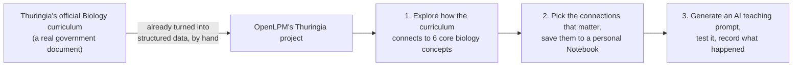
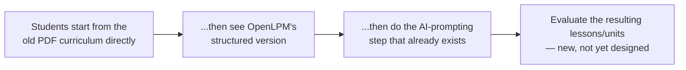

# The Thuringia / University of Jena pilot

**Part 1 is for anyone** — Susan Hanisch, a research assistant, a student in the pilot. **Part 2 is the technical trace** — exactly which real documents went in, how they became OpenLPM data, and what's still uncertain. Written 2026-10-02, checked directly against the real code and database migrations, not against memory or intent.

---

## Part 1: What this pilot is, in plain terms

[OpenLPM](../architecture/1-how-it-works.md) is a shared workspace where a research group builds a structured map of how understanding of a topic should develop across school grades, instead of doing that work in scattered documents. This pilot is one specific use of it: student teachers in Biologiedidaktik (biology teaching methods) at the **University of Jena**, working with **Susan Hanisch**, use OpenLPM to work with Thuringia's real, official Biology curriculum.

### What's already real and running today

Thuringia's actual government curriculum document has already been turned into structured data inside OpenLPM — by hand, over several months, not by pushing a button (Part 2 explains exactly how). Students work with that structured version through three steps that are already built and live:

Step 3 is a real feature: a student picks what they've saved, OpenLPM builds a starting prompt for them, they try it on whatever AI tool they choose, and then write down what happened and their own judgment of whether it was useful. That note is saved and can be revisited later.

### The new idea: comparing this against the old way

What you described — starting students with the **old PDF curriculum document first**, before they ever see OpenLPM, then having them go through OpenLPM, then AI-prompting, then evaluating the lessons/units that come out — is a real, good research question, but it **does not exist yet anywhere in this pilot's design**. Nothing currently asks a student to work from the raw PDF at all; the live design starts directly inside OpenLPM's already-structured version.

That's not a problem — it just means this is a new piece to design and decide on, not something already running that this document is merely describing. Part 2 lays out what a version of this would need (an actual way to compare "lesson quality," whether a PDF-only group is required, who evaluates the results, and whether a human-subjects/ethics review applies) rather than asserting it's settled.

---

## Part 2: The technical trace

### There are three different things named "Thuringia" in OpenLPM — only one is this pilot

This matters because it would be easy to cite the wrong one. Verified directly against the schema and migrations:

| Name (`projects.slug`) | What it actually is | Is it this pilot? |
|---|---|---|
| `evomentor-thuringia` | The real pilot — curriculum learning objectives, concepts, student view, Susan Hanisch's feedback | **Yes, this is it** |
| `eva-lpm-thueringen` | A separate project from a different lineage (eva-graph, not EvoMentor_DE). Its source data was declared but never actually imported — it's structurally empty | No |
| `thuringia-curriculum-repository` | A sub-project under "Germany," holding *policy-level* records (institutional actors, timeline events) imported from the separate `deutsche_lp` research repo — not curriculum learning objectives at all | No — different kind of content entirely |

### The real source documents

These live in a sibling repository, `EvoMentor_DE` (OpenLPM's predecessor for this specific curriculum), not inside OpenLPM itself:

- **The actual official document**: `LP Thüringen Bio Gym 2026 Erprobungsfassung.pdf` — Thuringia's real Ministry of Education Biology curriculum, trial ("Erprobungsfassung") version, ~1.5 MB.
- A matching pair of CSVs: a 70-row concept taxonomy, and a row-by-row diff of what changed between the 2024 and 2026 versions of the curriculum.
- `basiskonzepte.json` — a hand-maintained, versioned (currently v5.0) reference file defining the 6 core "Basiskonzepte" (foundational biology concepts) Thuringia's curriculum is organized around, citing the KMK (Germany's standing conference of education ministers) national standards and the Thuringia Gymnasium curriculum directly as its sources, with a real changelog of corrections across versions.
- Six further JSON files holding the complete sub-concept vocabulary under each of those 6 core concepts, and a separate file of "Kohärenzfäden" (coherence threads — the same narrative-sequence idea covered in the [full architecture reference](../architecture/3-full-reference.md#2-the-learning-progression-content-spine)).
- Grade-band-specific learning-objective datasets for grades 5/6 and 7–10.
- A **newer** document, added 2026-10-02: the 2026 trial curriculum for MNT (an integrated grades 5/6 science subject), transcribed to Markdown, with its own structural and item-by-item comparison against the 2015 version (121 individual learning objectives checked one by one). **This one has not been written into OpenLPM's database yet** — it's a source document waiting on an ingestion pass, not live content.

### How the real document became OpenLPM data — and the honest limits of that process

There is **no button, no automated importer, for this pilot's content.** (OpenLPM does have one real, live, automated curriculum importer — pulling from a public German curriculum-standards database — but that system has no data for Thuringia at all; its own code says so directly. Thuringia's content exists only because it was built by a different, manual path.)

What actually happened: across several sessions, a person (working with Claude Code) read the CSV and JSON files above directly and wrote one-time database migrations that insert or update the content. Each new batch of curriculum content became its own migration file — not a repeatable pipeline. A few of these migrations are honest about their own limits: one applied 4 of 15 known wording corrections and left the other 11 as a manual to-do, because the session doing it didn't have a safe way to match the remaining rows automatically.

**One real gap in the record, found while checking this**: no committed migration actually contains the step that first created this pilot's project or moved its original ~300 learning objectives into it. A later migration *refers* to that move as something that "already happened," but the statement that did it isn't in the repository's history — it was run directly against the live database at some point, outside the normal migration record. Not a sign of anything broken, just a real gap in provenance worth knowing about rather than papering over.

### What's actually in there today, with honest uncertainty

Every count below comes from a claim made in a migration's own comment or a page's own code comment — not from a live database query (nobody currently has a working way to run one; see the note at the end of this section). The number has grown over time and is not fully reconciled:

- Earliest recorded count: 302 learning objectives, 39 concepts.
- A later migration's own header claims 305.
- The most recent student-facing page's own comments say 306 topics.

Read that as "a bit over 300, grown in small batches, never independently re-counted" rather than a precise figure. Each learning objective, where it's stored, carries real structure worth knowing about: the original curriculum wording, which of the 6 core concepts it connects to and how strongly (rated 0–3, with a written justification for the rating), suggested teaching methods, and common misconceptions — not just a title and a grade level.

**A separate, discovered-in-passing finding, worth flagging on its own**: a stored database credential used for checking this content directly came back "permission denied" when tested — it may have been rotated or invalidated since it was last used. That's not something this document fixes, but it means a real, direct check against the live data currently isn't possible with what's on hand, and it's worth knowing before anyone assumes they can just query it.

### How this connects to the checked self-model

The [self-model](../architecture/3-full-reference.md#status-what-was-decided-whats-actually-built) added alongside this pilot's documentation applies the same discipline to OpenLPM's *software*: don't assert something is built without checking, and say plainly when something can't be confirmed. This section is that same discipline applied to one pilot's *data* instead of the schema: the curriculum content itself lives in the same tables the self-model already accounts for (`lpm_data_objects`, `lpm_schema_elements`, under the self-model's `platform-foundation` entry) — nothing pilot-specific was added to the software self-model itself, since a specific project's real content is a different kind of thing from the software that holds it (see the self-model's own opening note on keeping those two referents separate). What's specific to this pilot is the provenance trail above, and the one place that trail genuinely breaks.

### The proposed PDF-first comparison: what it would actually need

This is a sketch of what your idea would require to actually run, not a finished protocol — real decisions here are yours and Susan Hanisch's, not something to treat as settled by this document:

- **A real baseline task.** What exactly does "using the old PDF" mean as a task — planning the same lesson/unit cold, with no other support? That needs to be specified concretely enough that it's comparable to the OpenLPM-assisted version.
- **What "evaluation of lessons and units" actually measures.** A rubric, a set of criteria, or a judgment call by Susan Hanisch or another instructor — this determines whether the comparison produces anything you can actually learn from, versus just an impression.
- **Group structure.** Does every student do PDF-first then OpenLPM (one group, two phases), or do some students only ever see the PDF (a real control group)? These answer different questions and need different numbers of participants.
- **Human-subjects review.** This would be a real study of real students' work, potentially intended to be written up or published. Whether University of Jena's ethics process applies is a genuine open question this document isn't positioned to answer — worth checking before building anything around it, not after.
- **Timing.** The live 3-task pilot (Part 1) was already built under real time pressure for a pilot starting on a matter of weeks' notice. Adding a PDF-first phase in front of it is additional scope on the same clock, not a free add-on.

None of this blocks writing the study up as a proposal — it just means the proposal and the already-built pilot should stay clearly distinguished, including in any document (like this one) describing both.
